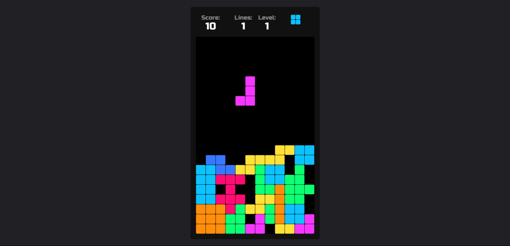

# Microsoft Azure DevOps launching Tetris Game

⚠️ **Disclaimer:** Please note that the Tetris app deployed in this project is not originally designed by [Me!](https://github.com/imharshag). Additionally, the game may contain sounds that are deemed inappropriate. However, efforts are being made to refine and enhance the game, ensuring it maintains a clean and family-friendly experience. Contributions to this project are welcomed and appreciated!

### Overview

This project showcases the deployment of a game, specifically a Tetris app, using Microsoft Azure DevOps and Azure Web App Service. The implementation leverages various Azure services to establish a robust Continuous Integration (CI) and Continuous Deployment (CD) pipeline, ensuring high availability, scalability, and reliability.

### 🚀 Implementation Steps

1. ***Developed the Tetris App***:
   - Wrote the app code using preferred programming language and framework.
   - Used Git for version control and hosted the code in a Git repository on Azure Repos or GitHub.

2. ***Setup Continuous Integration (CI)***:
   - Created a CI pipeline in Azure Pipelines to automate the build process.
   - Configured the pipeline to compile the Tetris app code, run tests, and package the application into a deployable artifact.
   - Integrated quality gates and code analysis tools to ensure build reliability and quality.

3. ***Setup Continuous Deployment (CD)***:
   - Created a CD pipeline in Azure Pipelines to automate the deployment process.
   - Configured the release pipeline to deploy the packaged artifact to Azure App Service.
   - Customized deployment stages and environments, incorporating approval gates if necessary.

4. ***Infrastructure as Code (IaC)***:
   - Used ARM templates or Azure CLI scripts to provision and configure the necessary infrastructure resources.

5. ***Monitoring and Logging***:
   - Set up monitoring and logging using Azure Monitor and Application Insights.
   - Configured custom metrics, alerts, and dashboards to monitor application performance, availability, and usage in real-time.

### 💡 Contribution

Contributions to this project are welcomed! You can contribute by:
1. Forking the repository.
2. Making your changes and committing them.
3. Pushing to your branch.
4. Creating a pull request.

### 📜 Document Links
[Project Documentation](https://drive.google.com/file/d/1sLw4O33hZT2X_a2-bsWfUPbFhdCSMI26/view?usp=drive_link)

### 📞 Contact

For any queries or support, please contact me at [My-Mail](mailto:harshag3106@gmail.com)

### 📜 License
This project is licensed under the MIT License. See the LICENSE file for more details.

